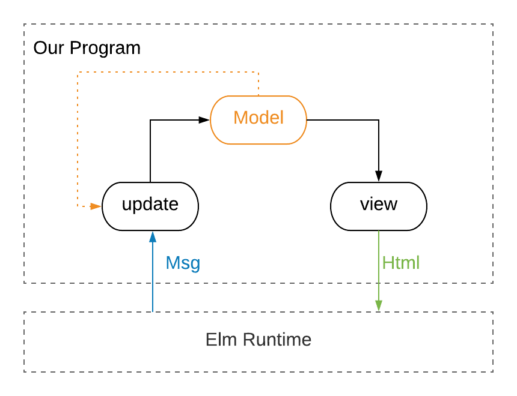
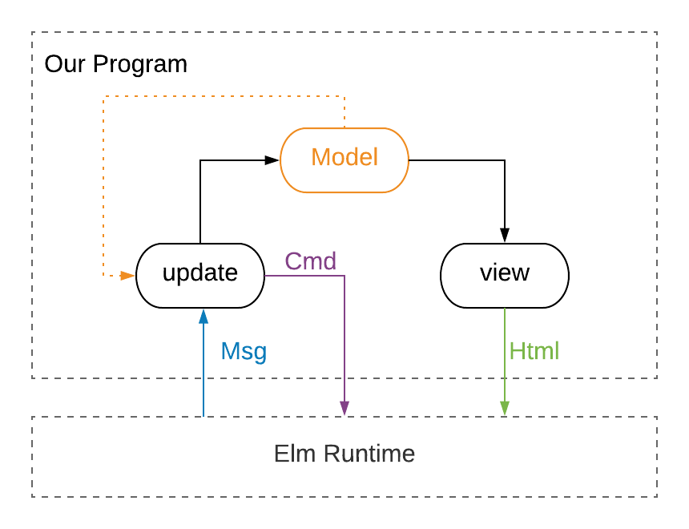

@title[Intro]

# Elm Workshop

### Kraków 2018

by
<br>
[@dmaterowski](https://twitter.com/dmaterowski) and [@FsharpWalker](https://twitter.com/FSharpWalker)

---

## Sponsor

TODO

---

## Agenda I

<ul class="list-no-point">
<li>9:00  - Welcome!</li>
<li>9:05  - Elm intro</li>
<li>9:30  - Ex1 - Basics</li>
<li>10:15 - Ex2 - TDD</li>
<li>10:55 - Ex3 - TEA time</li>
<li>12:00 - LUNCH</li>
</ul>

+++

## Agenda II

<ul class="list-no-point">
<li>13:00 - Ex4 - Forms</li>
<li>13:45 - Ex5 - Events</li>
<li>14:45 - Ex6 - Commands</li>
<li>15:45 - Ex7 - Decoders</li>
<li>16:15 - Ex8 - Encoders</li>
<li>16:45 - Ex9 - HTTP Requests</li>
<li>16:45 - Ex10 - Elm SPA</li>
<li>BYE!</li>
</ul>

---

## Elm Intro

---

### Slides

[https://gitpitch.com/fswalker/elm-workshop-slides](https://gitpitch.com/fswalker/elm-workshop-slides) 

---

### Theory 1

+++

#### Modules

- help organize your code
- name of the file should match <br> module name
- **C**ase **S**ensitive!
- use `alias` - less typing
- specific functions can be published (helps avoid namespace pollution)

+++

#### Expressions

- always evaluate to some **value**
- Elm program consists of expressions **exclusively**
- **no** statements!
- more readable code
- no surprises! (especially in runtime)

+++

#### Immutability

A value, once bound, cannot be changed! 

- complete **lack** of **mutation**
- More **robust** apps
- Programs **easier** to **reason** about 
- More **maintainable** codebase
- No unexpected state modifications

+++

#### Partial Application

We **apply** a function to an argument.

There can be **many** arguments.

No need to apply to all arguments at once!

+++

@title[Partial Application Example]
#### Partial Application Sample

```elm
add x y = x + y

increment = add 1

luckyNumber = increment 6
```

@[1]('add' function takes two arguments - x and y)
@[3](partially apply 'add' fn - give only one argument and obtain a new function called 'increment')
@[5](supply the last argument and return result = 7)

+++

#### Currying

A concept which represents transformation of a function with many arguments 

**to a chain of unary functions,**

which accept only **one input** and return only **one&nbsp;output**.

+++

### All functions in Elm are 
### automatically curried

+++

#### Currying explained

```elm
f : a -> b -> c -> d
f x y z = ...

f : a -> (b -> (c -> d))
f = \x -> (\y -> (\z -> ...))
```
@[1-2](f accepts three arguments: x, y and z of types: a, b, and c. Returns value of type d)
@[4-5](in fact f accepts one argument and returns one function until the last value is returned)

+++

#### Unit

Unit basically means _empty_, _void_ or _nothing_.

**Type** _unit_ has only one **value**.

Both type and value are 
<br>
represented by an empty tuple: **`()`**

+++

#### Unit Example

```elm
f : () -> Int
f () = 7

f () -- returns 7

g = \() -> 5
g () -- returns 5
```

@[1,2](Function f takes unit and returns Int)
@[4](Unit must be passed to fn in order to obtain a result)
@[6](We can use lambda notation)
@[7](We must pass unit! This is different than \\_ -> notation)

---

## Exercises

[https://github.com/dmaterowski/elm-workshop](https://github.com/dmaterowski/elm-workshop)

+++

@title[Rocket]


---

### Elm Installation

```shell
                     npm install -g elm
```

---

### Elm Docs

[http://package.elm-lang.org/packages/elm-lang/core/latest](http://package.elm-lang.org/packages/elm-lang/core/latest)
<br>

[http://elm-lang.org/docs/from-javascript](http://elm-lang.org/docs/from-javascript)

---

## Ex1 - Basics

+++

@title[You and Elm]

Only **You** and Elm

+++
<!-- .slide: data-autoslide="900000" -->

@title[Round 1]

Round 1 

**15 min**

+++

@title[End Round 1]

Time is up!

---

### Theory 2

+++

#### Records Recap 1

```elm
type alias Person =
    { name: String
    , age: Int
    }

type alias Pet =
    { name: String
    , legs: Int
    }

getName { name } = name
```

@[1-4](Define type Person - alias for record with props: name and age)
@[6-9](Define type Pet - alias for record with props: name and legs)
@[11](Function which takes record with property name and ignores other props)

+++

#### Records Recap 2
```elm
bob =
   { name = "Bob"
   , age = 25
   }

rex =
   { name = "Rex" 
   , legs = 4
   }

getName bob -- returns "Bob"

getName rex -- returns "Rex"
```

@[1-4](Define variable of type Person)
@[6-9](Define variable of type Pet)
@[11](Apply function getName to bob - return name)
@[13](Apply function getName to rex - return name again)

+++

#### Union Types

> A union type is a custom type you create by specifying the values it can contain.

<span class="aside">Feldman, R. *Elm in Action*. Manning Publications</span>

+++

##### Bool is a union type

```elm
type Bool = True | False
```

+++

##### Maybe is a union type

```elm
type Maybe value
    = Just value
    | Nothing
```

@[1](Declare type Maybe with type variable value)
@[2](First option - `Just` as a container/wrapper for value)
@[3](Second option - `Nothing` means: no value)

+++

##### Union Types - summary

* example of algebraic data structure
* can have multiple cases
* one case may wrap many data structures
* Elm's *case* expression

---

## Elm Test Installation

```shell
                     npm install -g elm-test
```


---

## Ex2 - Union Types & TDD

- Go to folder **Ex2**
- Run `elm-test`
- Exercise instructions: `Ex2/src/Ex2.elm`
- Instructions for running tests in a browser: `Ex2/tests/Tests.elm`

+++
<!-- .slide: data-autoslide="900000" -->

@title[Round 2]

Round 2

**15 min**

+++

@title[End Round 2]

Time is up!

---

### Theory 3

+++

#### The Elm Architecture

1. **M**odel
1. **U**pdate
1. **V**iew

+++

#### TEA Diagram



+++

#### `Html` Package

Three the most important modules:

- `Html`
- `Html.Attributes`
- `Html.Events`

+++

#### `Html.beginnerProgram`

```elm
main : Program Never model msg
main =
    Html.beginnerProgram
        { model = initialModel
        , view = view
        , update = update
        }
```
@[1](main - a program without flags, with model and msg)
@[2](main is an entry point of an elm web application)
@[3](function which initializes a web application)
@[4](model : model)
@[5](view : model -> Html msg)
@[6](update : msg -> model -> model)

+++

#### `Html` syntax recap

```html
<div class="content">
  <h1 class="title">Hello World</h1>
  <p>Lorem ipsum<sup>[1]</sup> dolor sit amet...</p>
</div>
```

+++

#### `Html` Module

```elm
text : String -> Html msg

h1 : List (Attribute msg) -> List (Html msg) -> Html msg
```
@[1](fn text takes string and returns it as an html node)
@[3](fn h1 takes attributes, children nodes and returns html node)

+++

#### `Html` Sample

```elm
main : Html msg
main =
    h1 [] [ text "Hello, World!" ]
```
@[1](main is of type Html with any message)
@[3](h1 element takes empty attributes list and list with text node child)

+++

#### `Html.Attributes` Sample

```elm
class : String -> Attribute msg

h1 : List (Attribute msg) -> List (Html msg) -> Html msg

main : Html msg
main =
    h1 [ class "title" ] [ text "Hello, World!" ]
```
@[1](takes class name argument, returns Attribute type)
@[3](h1 fn takes a list of Attributes)
@[5-7](usage of class attribute fn)

+++

#### `Html.Events` Sample

```elm
onClick : msg -> Attribute msg

h1 : List (Attribute msg) -> List (Html msg) -> Html msg

main : Html msg
main =
    h1 
        [ class "title" 
        , onClick "Greetings!"
        ] 
        [ text "Hello, World!" ]

h1 : List (Attribute String) -> List (Html String) -> Html String
```
@[1](takes whatever message, returns Attribute type with that msg)
@[3,7-10](h1 fn takes a list of Attribute elements)
@[9](onClick creates event listener which emits text)
@[3,13](msg type variable is now a concrete type String)

+++

#### Html2Elm

Translates your html to elm syntax automatically:

[https://mbylstra.github.io/html-to-elm/](https://mbylstra.github.io/html-to-elm/)

+++
<!-- .slide: data-autoslide="900000" -->

@title[Round 3]

Round 3

**15 min**

+++

@title[End Round 3]

Time is up!

---

### Theory 4

+++

#### Extensible Records

> Types that have at least certain fields, but may have others as well. 

[http://elm-lang.org/docs/records](http://elm-lang.org/docs/records)

+++

#### Extensible Records Sample

```elm
type alias Positioned a =
    { a | x : Float, y : Float }

type alias Person = { name: String }

alice : Positioned Person
alice = 
    { x = 1.0
    , y = 3.0
    , name = "Alice"
    }

getPos : Positioned a -> (Float,Float)
getPos {x,y} =
  (x,y)

getPos alice -- returns (1.0, 3.0)
```
@[1-2](extensible record definition)
@[4](helper record for the example)
@[6-11](definition of positioned record)
@[13-15](fn accepts position record)
@[17](getPos works for Positioned Person)

+++
<!-- .slide: data-autoslide="900000" -->

@title[Round 4]

Round 4

**15 min**

+++

@title[End Round 4]

Time is up!

---

### Theory 5

---

### Theory 6

+++

#### The Elm Architecture - Commands



+++

#### `Html.program`

```elm
main : Program Never model msg
main =
    Html.program
        :
        { init : (model, Cmd msg)
        , update : msg -> model -> (model, Cmd msg)
        , subscriptions : model -> Sub msg
        , view : model -> Html msg 
        }
        -> Program Never model msg
```
@[1](main - a program without flags, with model and msg)
@[2](main is an entry point of an elm web application)
@[3](function which initializes a web application)
@[5](init is a pair of model and command)
@[6](update fn takes message, model and returns new model with command)
@[7](subscriptions is a fn which takes model and returns subscriptions)
@[8](view accepts model and returns Html msg)


+++

#### `Html.program` - display date

```elm
type alias Model = Date

main =
    Html.program
        { init = ( Date.fromTime 0, Cmd.none )
        ...
```
@[1](Model is just a Date type)
@[5](init with Unix epoch start date and no command)

+++

#### `Html.program` - display current date

```elm
type Msg = UpdateDate Date

-- Date.now : Task x Date
-- Task.perform : (a -> msg) -> Task Never a -> Cmd msg
-- Our Task.perform : (Date -> Msg) -> Task Never Date -> Cmd Msg

main =
    Html.program
        { init = 
            ( Date.fromTime 0
            , Task.perform UpdateDate Date.now
            )
        ...

update : Msg -> Model -> ( Model, Cmd Msg )
update (UpdateDate d) model =
    ( d, Cmd.none )
```
@[1](Add Msg which contains new Date)
@[3](Date.now returns Task which returns current Date)
@[4](Task.perform accepts fn, Task, and returns Cmd)
@[5](Our fn is UpdateDate)
@[11](Cmd is a second element in the init pair)
@[15-17](update fn returns new model and no Cmd)

+++

#### `Html.program` - display date on action

```elm
type Msg 
    = UpdateDate Date
    | GetDate

update : Msg -> Model -> ( Model, Cmd Msg )
update msg model =
    case msg of
        UpdateDate d -> ( d, Cmd.none )
        GetDate -> ( model, Task.perform UpdateDate Date.now )

view : Model -> Html Msg
view model =
    div [] 
        [ button [ onClick GetDate ] [ text "Get Date" ]
        , text <| toString model
        ]

```
@[3](Add a Msg case which is used to ask for a date)
@[5-9](GetDate comes from Elm runtime - perform task, Cmd is created)
@[11-16](For instance, GetDate is emitted on button click)

+++
<!-- .slide: data-autoslide="900000" -->

@title[Round 6]

Round 6

**15 min**

+++

@title[End Round 6]

Time is up!

---

### Theory 7

+++

#### Result

```elm
type Result error value
    = Ok value
    | Err error
```
@[1-2](A Result is either Ok meaning the computation succeeded)
@[3](or it is an Err meaning that there was some failure)

+++

#### Json Decoders

> You use the Json.Decode library to convert wild and crazy JSON into nicely structured Elm values.

<span class="aside">Elm Guide</span>

+++

#### Basic decoder

```elm
string : Decoder String

decodeString : Decoder a -> String -> Result String a

decodeString int "42"
-- Ok 42 : Result String Int

decodeString int "true"
Err "Expecting an Int but instead got: true" : Result String Int
```
@[1](Primitive decoder which returns Elm String type)
@[3](fn which takes decoder, input string and tries to decode it)
@[5-6](decode input string using int decoder - it is ok!)
@[8-9](true is not an Int!)

+++

#### List decoder

```elm
list : Decoder a -> Decoder (List a)

decodeString (list int) "[1,2,3]"
-- Ok [1,2,3] : Result String (List Int)
```
@[1](list fn takes decoder and returns another decoder for list of values of the first decoder)
@[3-4](list int decodes the list of integers)

+++

#### Object decoder

```elm
field : String -> Decoder a -> Decoder a

decodeString (field "x" int) """{ "x": 3, "y": 4 }"""
-- Ok 3 : Result String Int
```
@[1](field fn takes field name decoder for field value and returns new decoder)
@[3-4](decode string which should contain object with field x of type int)

+++

#### Decode to records

```elm
map2 
    : (a -> b -> value) 
    -> Decoder a 
    -> Decoder b 
    -> Decoder value

type alias Point = { x : Int, y : Int }

pointDecoder : Decoder Point
pointDecoder = map2 Point (field "x" int) (field "y" int)

decodeString pointDecoder """{ "x": 3, "y": 4 }"""
Ok { x = 3, y = 4 } : Result String Point
```
@[1-2](map2 takes fn which takes two arguments and returns a value)
@[3-4](then it takes two decoders)
@[5](then it returns new decoder which decodes a value)
@[7](Point is a fn which takes two Int arguments)
@[9-10](both decoders are field decoders of type int)
@[12-13](JSON with object can be decoded)

+++

#### Advanced decoders

Special library for more advanced decoding scenarios:
[elm-decode-pipeline](http://package.elm-lang.org/packages/NoRedInk/elm-decode-pipeline/latest)

- more than 8 fields at once
- optional, required fields
- nice pipeline workflow style

---

@title[The End]

## Thank you! <i class="fa fa-smile-o" aria-hidden="true"> </i>


[Elm Slack @fa[slack]](http://elmlang.herokuapp.com/)
